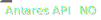

# Run Time-Series Generator



## Usage

``` r
runTsGenerator(
  path_solver = getOption("antares.solver"),
  wait = TRUE,
  show_output_on_console = FALSE,
  opts = antaresRead::simOptions()
)
```

## Arguments

- path_solver:

  Character containing the Antares Solver path.

- wait:

  Logical, indicating whether the R interpreter should wait for the
  simulation to finish, or run it asynchronously.

- show_output_on_console:

  Logical, indicating whether to capture the ANTARES log and show it on
  the R console.

- opts:

  List of simulation parameters returned by the function
  [`antaresRead::setSimulationPath`](https://rte-antares-rpackage.github.io/antaresRead/reference/setSimulationPath.html).

## Examples

``` r
if (FALSE) { # \dontrun{
library(antaresRead)
setSimulationPath(path = "path/to/study")

library(antaresEditObject)
runTsGenerator(
  path_solver = "path/to/antares-6.0-solver.exe", 
  show_output_on_console = TRUE
)
} # }
```
