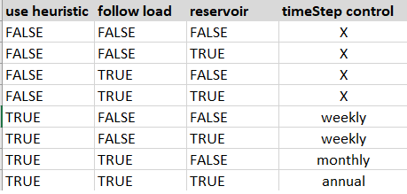

```{r, include = FALSE}
knitr::opts_chunk$set(
  collapse = TRUE,
  comment = "#>"
)
```

```{r setup}
 # CRAN limite CPU usage
data.table::setDTthreads(2)
library(antaresEditObject)
```

This thumbnail will present the new features in line with **Antares v8.6.0** (the link is [here](https://antares-simulator.readthedocs.io/en/stable/developer-guide/CHANGELOG/#branch-86x-end-of-support-062025))

There are 3 new features :  

>  - Add new storage type "short-term storage".  

>  - Update parameters of thermal clusters with "pollutant emission factors"  

>  - "Hydro Pmin" : new file "mingen.txt"

## Create new study

```{r init}
dir_path <- tempdir()
createStudy(path = dir_path, 
            study_name = "test860", 
            antares_version = "8.6.0")
```

## Create area 

```{r areas}
createArea(name = "fr")
createArea(name = "it")
```

## Create "st-storage"

We can create new st-storage cluster with new function `createClusterST()`. You can see function documentation with `?createClusterST`.  

By default you can call function only with two parameters (`area`, `cluster_name`). 

```{r st-storage}
inflows_data <- matrix(3, 8760)
ratio_values <- matrix(0.7, 8760)

createClusterST(area = "fr", 
                cluster_name = "test_storage", 
                storage_parameters = storage_values_default(), 
                PMAX_injection = ratio_values, 
                PMAX_withdrawal = ratio_values, 
                inflows = inflows_data, 
                lower_rule_curve = ratio_values, 
                upper_rule_curve = ratio_values, 
                overwrite = TRUE)

createClusterST(area = "it", 
                cluster_name = "test_storage", 
                storage_parameters = storage_values_default(), 
                PMAX_injection = ratio_values, 
                PMAX_withdrawal = ratio_values, 
                inflows = inflows_data, 
                lower_rule_curve = ratio_values, 
                upper_rule_curve = ratio_values, 
                overwrite = TRUE)
```


Now you can see informations in simulation options. 

```{r study options}
opts <- simOptions()
opts$areasWithSTClusters

```

## Read st-storages parameters
After creating "st-storage" clusters, you can read all information with specific function `readClusterSTDesc()`.

```{r read st-storage param}
tab <- readClusterSTDesc()
rmarkdown::paged_table(tab)
```

## Read st-storages data

St-storages data are time series you can read for all areas or a specific area. 5 files contening one time series are generated (one per each function parameter):  

 - PMAX-injection.txt  
 - PMAX-withdrawal.txt  
 - inflows.txt  
 - lower-rule-curve.txt  
 - upper-rule-curve.txt  

```{r read st-storage data}
data_st_storage <- readInputTS(st_storage = "all")
rmarkdown::paged_table(head(data_st_storage))
```

As you can see, the last two columns (`st-storage`,  `name_file`) give you value for each name file.  
**FYI** : As default, reading option for hourly timestep is `r opts$timeIdMax` (see `opts$timeIdMax`).

## Edit st-storage

It is possible to edit parameters values and data values like you want.   

```{r edit st-storage}
# edit parameters values 
list_params_st <- storage_values_default()
list_params_st$efficiency <- 0.5
list_params_st$reservoircapacity <- 50

# edit data values
inflows_data <- matrix(4, 8760)

editClusterST(area = "fr", 
              cluster_name = "test_storage", 
              storage_parameters = list_params_st,
              inflows = inflows_data,
              add_prefix = TRUE)

# read parameters
tab <- readClusterSTDesc()
rmarkdown::paged_table(tab)

# read data
data_st_storage <- readInputTS(st_storage = "all")
rmarkdown::paged_table(head(data_st_storage))
```

## Remove st-storage

Creating or editing st-storage are done, you can also remove clusters from study.   

```{r remove st-storage opts}
# remove cluster
removeClusterST(area = "fr", 
                cluster_name = "test_storage", 
                add_prefix = TRUE)

# delete control 
opts <- simOptions()
opts$areasWithSTClusters
```

The area `fr` is deleted cause we created only one cluster `test_storage`.  

```{r remove st-storage}
# control removed parameters
tab <- readClusterSTDesc()
rmarkdown::paged_table(head(tab))

# control removed data
data_st_storage <- readInputTS(st_storage = "all")
rmarkdown::paged_table(head(data_st_storage))

unique(data_st_storage$area)
```

Parameters and data concerning this cluster in this area are removed.

## Thermal pollutants parameters

Antares version 8.6.0 now provide pollutants parameters for thermal clusters. You can see the documentation on thermal clusters [here](https://rte-antares-rpackage.github.io/antaresEditObject/articles/antaresEditObject.html#create-a-new-cluster).  

You have global `list` of pollutants given by function `list_pollutants_values()`. By default, parameters are set to NULL, you can initialize all parameters with value or customize parameters.

```{r}
# create cluster with pollutants

# pollutants
all_param_pollutants <- list_pollutants_values(multi_values = 0.25)

createCluster(area = "fr", 
              cluster_name = "test_pollutant", 
              unitcount = 1L, 
              marginal_cost = 50,
              list_pollutants = all_param_pollutants, 
              time_series = matrix(rep(c(0, 8000), each = 24*364), ncol = 2),
              prepro_modulation = matrix(rep(c(1, 1, 1, 0), each = 24*365), ncol = 4) 
              )
```

```{r pollutants param}
# read parameters
param_th_cluster <- readClusterDesc()
rmarkdown::paged_table(param_th_cluster)
```

Let's see how to edit 3 parameters **`r names(list_pollutants_values())[1:3]`**.  

```{r edit pollutants}
# editing
edit_param_pollutants <- list_pollutants_values(multi_values = 0.3)[1:3]

editCluster(area = "fr", 
            cluster_name = "test_pollutant",
            unitcount = 2L, 
            list_pollutants = edit_param_pollutants)

# read parameters
param_th_cluster <- readClusterDesc()
rmarkdown::paged_table(param_th_cluster)
```

## Hydro - MINGEN file

Antares version 8.6.0 provides new file `mingen.txt`, this file must respect some conditions.  
The first condition to respect is the dimension with file `mod.txt`.   
The second one is the consistency of the data between 3 files (`mingen.txt`, `mod.txt`, `maxpower_{area}.txt`).  

  
Full documentation is available in the function `writeInputTS()`. We will see further information for values checks.   

**Values checks : **  

Checks depends of values of parameters in `hydro.ini` file.

```{r schema combinatoire , echo=FALSE, fig.cap="", out.width = '50%', fig.align='center'}

```

```{r schema, echo=FALSE, fig.cap="", out.width = '75%', fig.align='center'}
# path_image <- sourcedir860 <- system.file("doc/schemas", package = "antaresEditObject")
# knitr::include_graphics(file.path(path_image,"mingen.png"))
knitr::include_graphics("schemas/mingen_draw.png")
```

After creating study, `.txt` files containing time series are empty. We will describe steps to edit `mingen.txt`.  
  
  
**Initial values :**  


```{r hydro ini}
# see hydro parameters 
path_file_hydro <- file.path("input", "hydro", "hydro.ini")
hydro_ini_values <- readIni(pathIni = path_file_hydro)
hydro_params <- c('follow load', 'use heuristic', "reservoir")
hydro_ini_values[hydro_params]
```


**Steps to create mingen file :**

```{r edit mod}
# Initialize mingen data (time series)
mingen_data = matrix(0.06,8760,5)

# 1 - edit mod file (time series)
mod_data = matrix(6,365,5)
suppressWarnings(
  writeInputTS(area = "fr", type = "hydroSTOR", 
             data = mod_data, 
             overwrite = TRUE)
)

```

```{r edit maxpower}
# 2 - edit maxpower 
maxpower_data <- matrix(6,365,4)
suppressWarnings(
  writeHydroValues(area = "fr", 
                 type = "maxpower", 
                 data = maxpower_data)
)

```


```{r edit mingen}
# 3 - edit mingen
suppressWarnings(
  writeInputTS(area = "fr", type = "mingen", 
             data = mingen_data, 
             overwrite = TRUE)
)

```


Now we can read time series. 

```{r read mingen}
# read input time series
read_ts_file <- readInputTS(mingen = "all")
rmarkdown::paged_table(head(read_ts_file))
```


```{r delete study, include=FALSE}
# Delete study
    unlink(opts$studyPath, 
           recursive = TRUE)
# clean global options
options(antares = NULL)
```


